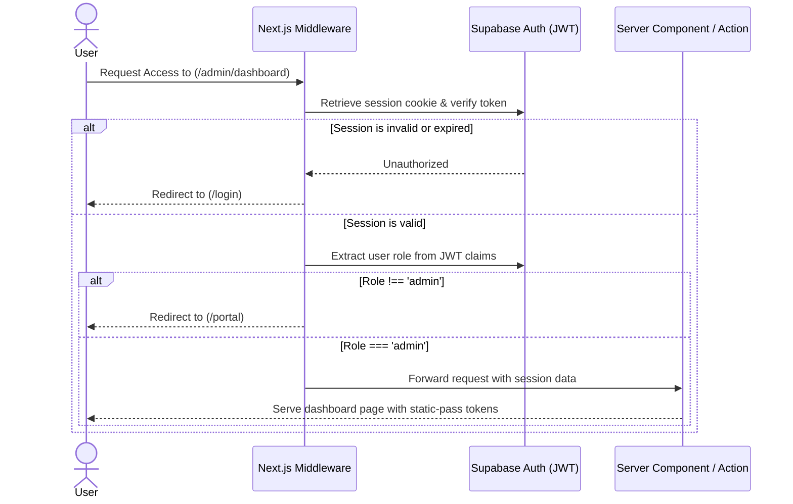
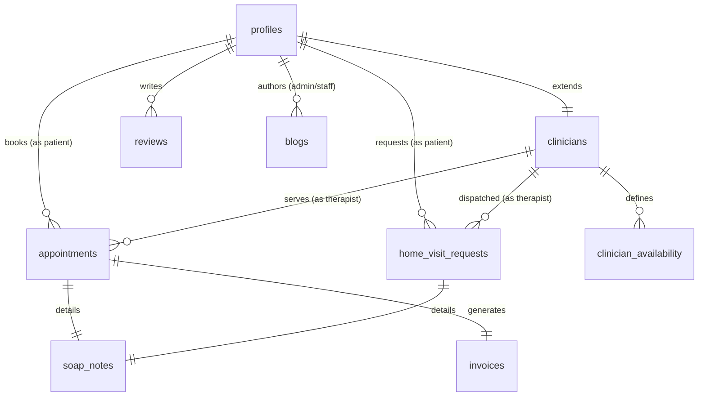
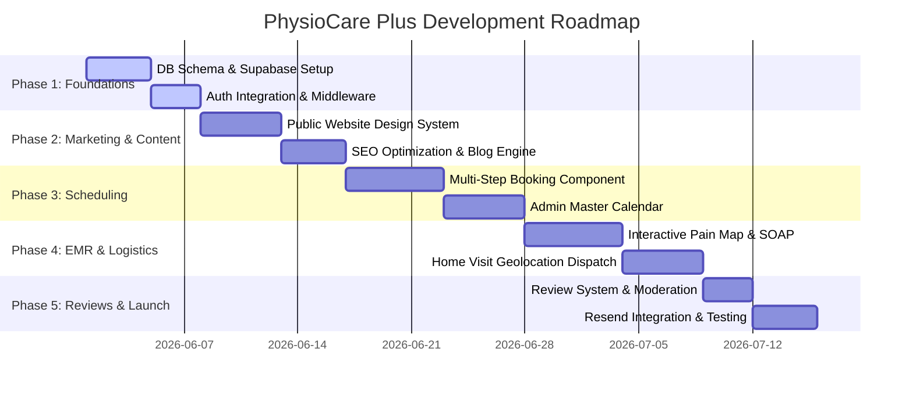

# Enterprise Architecture Plan: PhysioCare Plus
## High-Fidelity System Design & SaaS Architecture

---

## 1. Directory & Folder Structure

We adopt a hybrid architectural structure combining **Feature-Sliced Design (FSD)** patterns and standard **Next.js App Router** conventions. This ensures that as the codebase scales, components, hooks, and database actions are located adjacent to their related features rather than being scattered globally.

```
d:\Physo\physiocare-plus\
├── public/                     # Static assets (images, icons, vectors)
├── src/
│   ├── app/                    # File-System Routing (App Router)
│   │   ├── (auth)/             # Route Group: Authentication (Login, Register, Reset)
│   │   ├── (admin)/            # Route Group: Administrator Command Center
│   │   ├── (portal)/           # Route Group: Patient Portal Dashboard
│   │   ├── (public)/           # Route Group: Public Marketing Pages
│   │   ├── api/                # API Route Handlers (Webhooks, Resend, PDF generation)
│   │   ├── layout.tsx          # Global Application Layout
│   │   ├── globals.css         # Tailwind global styles
│   │   └── providers.tsx       # React Context Providers (QueryClient, Auth, Theme)
│   │
│   ├── components/             # Shared Design System (Atomic Components)
│   │   ├── ui/                 # Headless/Custom UI Elements (Button, Dialog, Accordion)
│   │   ├── layout/             # Shared Layout Components (Navbar, AdminSidebar, Footer)
│   │   └── shared/             # General utilities (DataTables, SkeletonLoaders)
│   │
│   ├── features/               # Domain-Specific Module Folders (Feature-Sliced)
│   │   ├── auth/               # Auth forms, user state hooks, actions
│   │   ├── appointments/       # Booking engine components, booking actions, calendar
│   │   ├── patients/           # EMR timeline, SOAP notes, pain-map component
│   │   ├── home-visits/        # Map dispatch, distance calculator, forms
│   │   ├── reviews/            # Verified testimonial widgets, moderation panels
│   │   └── blog/               # Markdown editor, tag list, blog cards
│   │
│   ├── lib/                    # SDK & API Configurations
│   │   ├── supabase/           # Supabase Client, Server, and Middleware clients
│   │   ├── resend/             # Resend Email Client
│   │   └── db/                 # Database helpers and Zod schema validators
│   │
│   ├── hooks/                  # Global Reusable Hooks
│   │   ├── use-debounce.ts
│   │   ├── use-media-query.ts
│   │   └── use-toast.ts
│   │
│   ├── types/                  # Global TypeScript Interfaces
│   │   ├── database.types.ts   # Generated Supabase types
│   │   └── index.ts            # Custom domain-specific models
│   │
│   └── utils/                  # Domain-agnostic pure helper functions
│       ├── date-formatter.ts
│       ├── geo-helpers.ts
│       └── whatsapp-generator.ts
│
├── next.config.ts              # Next.js 16 compiler configs
├── tailwind.config.ts          # Modern visual design tokens
└── tsconfig.json               # Path-mapped typescript configurations
```

---

## 2. Feature Architecture & System Flows

### 2.1 Authentication & Middleware Security Flow
*   **Authentication Guard**: The application relies on Supabase Auth (JWT). Next.js Middleware acts as a reverse proxy, checking and decrypting the JWT session cookie at the edge.
*   **Role Validation**: Upon session verification, the middleware queries the cache/database to match user roles (`patient`, `clinician`, `admin`) and routes them accordingly, returning a `403 Forbidden` or redirecting unauthorized users.



### 2.2 Interactive Multi-Step Booking Engine
*   **Optimistic Pre-allocation**: Prevents transaction deadlocks by pulling real-time availability dynamically and blocking selected temporary timeslots on the client.
*   **Transaction Locking**: Prevents double-bookings at the database layer using unique combined index constraints: `(clinician_id, appointment_date, start_time)`.

### 2.3 Home Visit Dispatch & Distance Routing
*   **Geospatial Evaluation**: Incorporates Google Maps Distance Matrix. Calculates route distances from the physical clinic.
*   **Service Threshold**: If distance is $> 25\text{km}$, the request triggers a warning and redirects to tele-rehab. If valid, it computes the dynamically graduated transit cost:
    $$\text{Total Fee} = \text{Base Treatment Fee} + (\text{Distance in km} \times \text{Rate per km})$$
*   **Admin Dashboard Matcher**: An algorithm highlights the nearest active physiotherapist with matching specialty criteria for quick assignment.

### 2.4 EMR Timeline, Body Pain Mapping & SOAP Notes
*   **Unified Medical History**: Aggregates clinic sessions, home treatments, and medical uploads into a chronological vertical timeline.
*   **Interactive Pain Map**: An interactive SVG body component representing anterior and posterior coordinates. Clinicians tap on muscle zones to record pain levels (1-10) and tissue pathology metadata.
*   **SOAP Note Regulatory Compliance**: Built with auto-save. Once submitted, it enters a `24-hour grace window` during which modifications can be made. After 24 hours, the record locks, and modifications require a signed addendum log.

---

## 3. Route Structure (Next.js 16)

Below is the directory map of the Next.js App Router, demonstrating layout groupings and rendering strategies.

| Path Folder | URL Endpoint | Access Level | Rendering | Core Purpose |
| :--- | :--- | :--- | :--- | :--- |
| **`app/(public)/page.tsx`** | `/` | Public | **ISR** (1 hr) | Hero section, treatments list, interactive clinician profile cards. |
| **`app/(public)/about/page.tsx`** | `/about` | Public | Static | Background of doctors, certifications, clinic standards. |
| **`app/(public)/services/page.tsx`** | `/services` | Public | Static | Service matrix, treatment modalities, booking CTAs. |
| **`app/(public)/home-visit/page.tsx`**| `/home-visit` | Public | Static | Geolocation eligibility checker, details of home care. |
| **`app/(public)/testimonials/page.tsx`**| `/testimonials` | Public | **ISR** (12 hr) | Filterable reviews grid by ailment and practitioner. |
| **`app/(public)/blog/page.tsx`** | `/blog` | Public | **ISR** (24 hr) | Wellness and physical rehab educational articles feed. |
| **`app/(public)/blog/[slug]/page.tsx`**| `/blog/[slug]` | Public | **ISR** (24 hr) | Individual article with dynamic SEO JSON-LD tags. |
| **`app/(public)/contact/page.tsx`** | `/contact` | Public | Static | Dynamic contact form, opening hours status, WhatsApp CTA. |
| **`app/(auth)/login/page.tsx`** | `/login` | Public | Dynamic | Supabase OTP/Email auth entry form. |
| **`app/(portal)/portal/page.tsx`** | `/portal` | **Patient** | Dynamic | Dashboard: Countdown to booking, home exercise updates. |
| **`app/(portal)/portal/book/page.tsx`**| `/portal/book` | **Patient** | Dynamic | Interactive booking engine. |
| **`app/(portal)/portal/visits/page.tsx`**| `/portal/visits` | **Patient** | Dynamic | Home visit request logging, GPS mapping, fee breakdown. |
| **`app/(portal)/portal/records/page.tsx`**| `/portal/records`| **Patient** | Dynamic | View care plans, diagnostic timeline, document library. |
| **`app/(admin)/admin/page.tsx`** | `/admin` | **Admin/Staff**| Dynamic | Main dashboard: Booking metrics, revenue graphs, stats. |
| **`app/(admin)/admin/patients/page.tsx`**| `/admin/patients`| **Admin/Staff**| Dynamic | Directory search, deep EMR summaries, SOAP creator. |
| **`app/(admin)/admin/appointments/page.tsx`**| `/admin/appointments`| **Admin/Staff**| Dynamic | Master scheduling calendar, drag-drop slot overrides. |
| **`app/(admin)/admin/reviews/page.tsx`**| `/admin/reviews` | **Admin** | Dynamic | Patient feedback moderation queue (Approve/Reject). |
| **`app/(admin)/admin/blogs/page.tsx`** | `/admin/blogs` | **Admin/Staff**| Dynamic | Rich-text Markdown blog post publisher. |
| **`app/(admin)/admin/settings/page.tsx`**| `/admin/settings`| **Admin** | Dynamic | Configuration: Clinician slots, pricing models. |

---

## 4. Component Hierarchy

### 4.1 Multi-Step Booking Engine Component Tree
```
BookingWizard (Container - Client Component)
├── WizardProgressBar (Visual status indicator)
├── Step1_ServiceSelection (Selection grid of treatments & durations)
│   └── ServiceCard (Title, price, eligibility info)
├── Step2_ClinicianSelector (Selects physiotherapist based on schedules)
│   └── ClinicianBioCard (Rating, bio, avatar, specialties)
├── Step3_DateTimePicker (Date selector & time slot grid)
│   ├── CalendarPicker (Dynamic month view with available days)
│   └── TimeSlotSelector (Dynamically filtered slots)
├── Step4_PatientDetails (Medical symptoms and file uploader)
│   └── IntakeForm (Reason for visit, previous trauma, allergies)
└── Step5_ReviewConfirmation (Summarized receipt & dynamic checkout trigger)
```

### 4.2 Admin Master Calendar Component Tree
```
MasterSchedulerCalendar (Container - Client Component)
├── CalendarHeader (Controls: Daily/Weekly views, Month swiper)
├── ClinicianFilterBar (Horizontal avatars list to toggle views)
├── CalendarGrid (Timeline scale: 08:00 AM - 08:00 PM)
│   ├── TimeScaleIndicator (Left aligned list of hours)
│   └── ClinicianColumnsList (Side-by-side clinician column grids)
│       └── ClinicianColumn (Per-therapist timeline grid)
│           ├── AppointmentCard (Overlay card: Patient, Status, Room)
│           │   └── StatusBadge (Color-coded: Pending, Confirmed, Checked-In)
│           └── AvailabilityBlocker (Grayed zones indicating blocked slots)
└── AppointmentDetailModal (Sidebar slide-out panel for single selection)
    ├── QuickActions (Cancel, Mark No-Show, Reschedule)
    └── LinkToEMRButton (Direct route to patient records)
```

### 4.3 Patient Clinical EMR & SOAP Creator Component Tree
```
PatientEMRContainer (Container - Hybrid Server/Client)
├── PatientProfileSummary (Sticky top: Photo, allergies, emergency contacts)
├── EMRTabsLayout (Toggles between: Medical Timeline | Document Library)
│   ├── MedicalTimeline (Vertical chronological list of all sessions)
│   │   ├── SOAPNoteViewerCard (Collapsible full SOAP read-only card)
│   │   └── HomeVisitLogCard (Distance, transit details, clinician dispatch info)
│   └── DocumentLibrary (Upload logs and document folders)
│       ├── FileDropZone (Secure file inputs)
│       └── FileGridItem (Thumbnails for diagnostic PDFs)
└── SOAPNoteEditorPanel (Sidebar - Clinician Role Only)
    ├── AnatomicalPainMap (Interactive SVG human anatomical body map)
    │   ├── PaintMapCanvas (Anterior/Posterior drawing/pinning layers)
    │   └── PainIntensitySlider (Valuates current marker: scale 1-10)
    ├── FormInputs (Subjective, Objective, Assessment, Plan inputs)
    └── SubmitBar (Auto-save status, submit button, sign-off signature input)
```

---

## 5. Production-Ready Database Schema



### 5.1 Tables DDL (SQL Script)

```sql
-- Enable UUID generator and geospatial GIS extensions
CREATE EXTENSION IF NOT EXISTS "uuid-ossp";
CREATE EXTENSION IF NOT EXISTS "cube";
CREATE EXTENSION IF NOT EXISTS "earthdistance"; -- Helps in fast clinic distance calculations

-- Role definition enumeration
CREATE TYPE user_role AS ENUM ('patient', 'clinician', 'admin');
CREATE TYPE appointment_status AS ENUM ('pending', 'confirmed', 'completed', 'cancelled', 'no_show');
CREATE TYPE home_visit_status AS ENUM ('requested', 'approved', 'assigned', 'en_route', 'active', 'completed', 'cancelled');
CREATE TYPE payment_status AS ENUM ('unpaid', 'paid', 'refunded');

-- 1. Profiles Table (Linked to Supabase auth.users)
CREATE TABLE profiles (
    id UUID REFERENCES auth.users(id) ON DELETE CASCADE PRIMARY KEY,
    first_name VARCHAR(50) NOT NULL,
    last_name VARCHAR(50) NOT NULL,
    email VARCHAR(255) UNIQUE NOT NULL,
    phone VARCHAR(20) NOT NULL,
    role user_role DEFAULT 'patient' NOT NULL,
    date_of_birth DATE,
    gender VARCHAR(20),
    emergency_contact_name VARCHAR(100),
    emergency_contact_phone VARCHAR(20),
    medical_allergies TEXT,
    created_at TIMESTAMP WITH TIME ZONE DEFAULT timezone('utc'::text, now()) NOT NULL,
    updated_at TIMESTAMP WITH TIME ZONE DEFAULT timezone('utc'::text, now()) NOT NULL
);

-- 2. Clinicians Table
CREATE TABLE clinicians (
    id UUID REFERENCES profiles(id) ON DELETE CASCADE PRIMARY KEY,
    specialties TEXT[] NOT NULL,
    bio TEXT NOT NULL,
    license_number VARCHAR(100) UNIQUE NOT NULL,
    avatar_url TEXT,
    is_active BOOLEAN DEFAULT TRUE NOT NULL,
    created_at TIMESTAMP WITH TIME ZONE DEFAULT timezone('utc'::text, now()) NOT NULL
);

-- 3. Clinician Availability Table
CREATE TABLE clinician_availability (
    id UUID PRIMARY KEY DEFAULT uuid_generate_v4(),
    clinician_id UUID REFERENCES clinicians(id) ON DELETE CASCADE NOT NULL,
    day_of_week INT NOT NULL CHECK (day_of_week BETWEEN 0 AND 6),
    start_time TIME NOT NULL,
    end_time TIME NOT NULL,
    is_home_visit_eligible BOOLEAN DEFAULT FALSE NOT NULL,
    CONSTRAINT unique_clinician_time UNIQUE (clinician_id, day_of_week, start_time, end_time)
);

-- 4. Appointments Table
CREATE TABLE appointments (
    id UUID PRIMARY KEY DEFAULT uuid_generate_v4(),
    patient_id UUID REFERENCES profiles(id) ON DELETE CASCADE NOT NULL,
    clinician_id UUID REFERENCES clinicians(id) ON DELETE RESTRICT NOT NULL,
    appointment_date DATE NOT NULL,
    start_time TIME NOT NULL,
    end_time TIME NOT NULL,
    status appointment_status DEFAULT 'pending' NOT NULL,
    reason_for_visit TEXT NOT NULL,
    cancellation_reason TEXT,
    created_at TIMESTAMP WITH TIME ZONE DEFAULT timezone('utc'::text, now()) NOT NULL,
    updated_at TIMESTAMP WITH TIME ZONE DEFAULT timezone('utc'::text, now()) NOT NULL,
    CONSTRAINT prevent_overlapping_appointment UNIQUE (clinician_id, appointment_date, start_time)
);

-- 5. Home Visit Requests Table
CREATE TABLE home_visit_requests (
    id UUID PRIMARY KEY DEFAULT uuid_generate_v4(),
    patient_id UUID REFERENCES profiles(id) ON DELETE CASCADE NOT NULL,
    clinician_id UUID REFERENCES clinicians(id) ON DELETE SET NULL,
    request_date DATE NOT NULL,
    preferred_time_window VARCHAR(50) NOT NULL,
    address TEXT NOT NULL,
    latitude DECIMAL(9,6) NOT NULL,
    longitude DECIMAL(9,6) NOT NULL,
    distance_km DECIMAL(5,2) NOT NULL,
    transit_fee DECIMAL(10,2) DEFAULT 0.00 NOT NULL,
    symptoms TEXT NOT NULL,
    status home_visit_status DEFAULT 'requested' NOT NULL,
    completed_at TIMESTAMP WITH TIME ZONE,
    created_at TIMESTAMP WITH TIME ZONE DEFAULT timezone('utc'::text, now()) NOT NULL,
    updated_at TIMESTAMP WITH TIME ZONE DEFAULT timezone('utc'::text, now()) NOT NULL
);

-- 6. SOAP Notes Table (Regulatory encrypted text details)
CREATE TABLE soap_notes (
    id UUID PRIMARY KEY DEFAULT uuid_generate_v4(),
    appointment_id UUID REFERENCES appointments(id) ON DELETE SET NULL,
    home_visit_id UUID REFERENCES home_visit_requests(id) ON DELETE SET NULL,
    patient_id UUID REFERENCES profiles(id) ON DELETE CASCADE NOT NULL,
    clinician_id UUID REFERENCES clinicians(id) ON DELETE RESTRICT NOT NULL,
    subjective TEXT NOT NULL,
    objective TEXT NOT NULL,
    assessment TEXT NOT NULL,
    plan TEXT NOT NULL,
    pain_points_json JSONB, -- Stores coordinates and values for visual pain mapping
    is_locked BOOLEAN DEFAULT FALSE NOT NULL,
    locked_at TIMESTAMP WITH TIME ZONE,
    created_at TIMESTAMP WITH TIME ZONE DEFAULT timezone('utc'::text, now()) NOT NULL,
    updated_at TIMESTAMP WITH TIME ZONE DEFAULT timezone('utc'::text, now()) NOT NULL
);

-- 7. Reviews Table
CREATE TABLE reviews (
    id UUID PRIMARY KEY DEFAULT uuid_generate_v4(),
    patient_id UUID REFERENCES profiles(id) ON DELETE CASCADE NOT NULL,
    clinician_id UUID REFERENCES clinicians(id) ON DELETE CASCADE,
    rating INT NOT NULL CHECK (rating BETWEEN 1 AND 5),
    comment TEXT NOT NULL,
    is_approved BOOLEAN DEFAULT FALSE NOT NULL,
    approved_by UUID REFERENCES profiles(id) ON DELETE SET NULL,
    created_at TIMESTAMP WITH TIME ZONE DEFAULT timezone('utc'::text, now()) NOT NULL
);

-- 8. Blogs Table
CREATE TABLE blogs (
    id UUID PRIMARY KEY DEFAULT uuid_generate_v4(),
    author_id UUID REFERENCES profiles(id) ON DELETE RESTRICT NOT NULL,
    title VARCHAR(255) NOT NULL,
    slug VARCHAR(255) UNIQUE NOT NULL,
    content TEXT NOT NULL,
    meta_description VARCHAR(160) NOT NULL,
    featured_image_url TEXT,
    tags TEXT[],
    is_published BOOLEAN DEFAULT FALSE NOT NULL,
    published_at TIMESTAMP WITH TIME ZONE,
    created_at TIMESTAMP WITH TIME ZONE DEFAULT timezone('utc'::text, now()) NOT NULL,
    updated_at TIMESTAMP WITH TIME ZONE DEFAULT timezone('utc'::text, now()) NOT NULL
);

-- 9. Invoices Table
CREATE TABLE invoices (
    id UUID PRIMARY KEY DEFAULT uuid_generate_v4(),
    appointment_id UUID REFERENCES appointments(id) ON DELETE SET NULL,
    home_visit_id UUID REFERENCES home_visit_requests(id) ON DELETE SET NULL,
    patient_id UUID REFERENCES profiles(id) ON DELETE CASCADE NOT NULL,
    amount DECIMAL(10,2) NOT NULL,
    status payment_status DEFAULT 'unpaid' NOT NULL,
    payment_method VARCHAR(50),
    created_at TIMESTAMP WITH TIME ZONE DEFAULT timezone('utc'::text, now()) NOT NULL
);
```

### 5.2 Performance Indexes
```sql
CREATE INDEX idx_profiles_role ON profiles(role);
CREATE INDEX idx_appointments_date_time ON appointments(appointment_date, start_time);
CREATE INDEX idx_appointments_patient ON appointments(patient_id);
CREATE INDEX idx_appointments_clinician ON appointments(clinician_id);
CREATE INDEX idx_home_visits_status ON home_visit_requests(status);
CREATE INDEX idx_soap_notes_patient ON soap_notes(patient_id);
CREATE INDEX idx_blogs_slug ON blogs(slug);
CREATE INDEX idx_reviews_approved ON reviews(is_approved);
```

---

## 6. Implementation & Development Roadmap

We segment the project lifecycle into **five execution sprints**, guaranteeing that authentication, database security policies, and scheduling constraints are completed prior to dynamic page assembly.



### 6.1 Roadmap Sprint Milestones

#### Phase 1: Infrastructure, Relational Model & Authentication (Sprint 1)
*   Deploy database migrations in Supabase containing all RLS capabilities.
*   Enforce security scopes using Supabase auth profiles triggers.
*   Install route groupings (`(auth)`, `(public)`, `(portal)`) inside the `src/app` space.
*   Validate Next.js Middleware redirects for guest, clinician, and admin accounts.

#### Phase 2: Responsive Front-End & Blog CMS Engine (Sprint 2)
*   Inject the brand styling framework into `globals.css` using dynamic theme CSS variables.
*   Deploy SEO metadata configurations on public routes.
*   Create marketing components (Home page, Service directory, About clinician).
*   Integrate Markdown capabilities to process health articles.

#### Phase 3: Appointment Booking Engine & Multi-Calendar Controls (Sprint 3)
*   Assemble the multi-step `BookingWizard` using state machinery.
*   Apply the `no_double_booking` lock constraint within PostgreSQL.
*   Draft the `MasterSchedulerCalendar` interface in the Admin panel.
*   Link calendar event transitions (drag-and-drop to update appointment time) directly to server actions.

#### Phase 4: EMR Management, Pain Coordinates Canvas & Dispatch Logistics (Sprint 4)
*   Construct the interactive anatomical body canvas for muscle diagnostic logs.
*   Apply locking processes to the `soap_notes` schema.
*   Integrate Google maps routing checks inside `home_visit_requests`.
*   Implement automatic transit price multipliers based on geodistance vectors.

#### Phase 5: Moderation Workflow, Notification Dispatches & Launch (Sprint 5)
*   Publish patient rating widgets with review moderation tools for administrators.
*   Configure Resend API to handle appointment confirmations, home visit updates, and therapist agendas.
*   Deploy client telemetry, handle build validation checks, and host the platform live on Vercel.
