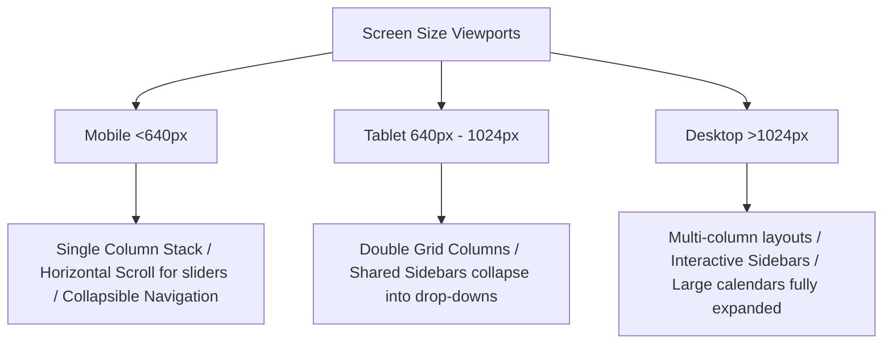

# UI Architecture & Responsive Design Specifications
## PhysioCare Plus Visual System & Responsive Strategy

---

## 1. The Design System & Aesthetic Core

To establish a premium, state-of-the-art visual experience that instills trust and feels high-end, the UI system avoids generic colors and standard components. It adopts a modern medical-wellness aesthetic featuring fluid gradients, glassmorphism, and responsive micro-animations.

### 1.1 Curated Color Palette (Tailwind Design System Tokens)
We utilize a primary color palette inspired by nature and clinical precision, employing balanced HSL ranges.

```typescript
// tailwind.config.ts
export default {
  theme: {
    extend: {
      colors: {
        brand: {
          50:  'hsl(165, 60%, 98%)',   // Ultra soft teal tint
          100: 'hsl(165, 55%, 95%)',
          500: 'hsl(165, 75%, 38%)',   // Primary Wellness Mint (Clinical Main)
          600: 'hsl(165, 80%, 30%)',   // Hover state
          900: 'hsl(165, 85%, 12%)',   // Dark branding background
        },
        accent: {
          50:  'hsl(205, 70%, 98%)',   // Ice Blue background tint
          500: 'hsl(205, 85%, 45%)',   // Hydrotherapy Blue
          600: 'hsl(205, 90%, 38%)',
        },
        neutral: {
          50:  'hsl(210, 20%, 98%)',   // Off-white slate
          900: 'hsl(215, 28%, 12%)',   // Sleek Dark Mode Background
          950: 'hsl(215, 32%, 8%)',    // Pure Dark Depth
        }
      },
      fontFamily: {
        sans: ['var(--font-outfit)', 'Inter', 'sans-serif'],
        display: ['var(--font-cabinet)', 'Outfit', 'sans-serif'],
      },
      boxShadow: {
        glass: '0 8px 32px 0 rgba(0, 0, 0, 0.08)',
        'glass-dark': '0 8px 32px 0 rgba(0, 0, 0, 0.37)',
      }
    }
  }
}
```

### 1.2 Premium Styling Utilities
*   **Glassmorphic Cards**: `backdrop-blur-md bg-white/70 dark:bg-neutral-900/70 border border-white/20 dark:border-neutral-800/20 shadow-glass`
*   **Aesthetic Gradients**: High-impact text utilizes `bg-clip-text text-transparent bg-gradient-to-r from-brand-600 to-accent-500`
*   **Micro-Animations**: All interactive items use `transition-all duration-300 ease-out` with subtle scaling (`active:scale-98 hover:-translate-y-0.5`).

---

## 2. Wireframe Structure & UI Blueprints

### 2.1 Public Homepage Layout Wireframe
```
+-----------------------------------------------------------------------------------+
|  [Logo] PhysioCare Plus          [Services]  [About]  [Testimonials]  [CTA: Book] |
+-----------------------------------------------------------------------------------+
|                                                                                   |
|  /-----------------------------------------------------------------------------\  |
|  |  GRADIENT HERO HEADER                                                       |  |
|  |  "Restore Your Body's Natural Motion"                                       |  |
|  |  Dynamic clinical rehabilitation by physical experts.                       |  |
|  |                                                                             |  |
|  |  [Book In-Clinic Session]           [Request Home Physiotherapy]            |  |
|  \-----------------------------------------------------------------------------/  |
|                                                                                   |
+-----------------------------------------------------------------------------------+
|                                                                                   |
|  [ CLINICAL SPECIALTIES ]                                                         |
|  +------------------------+ +------------------------+ +------------------------+  |
|  | Sports Injury Rehab    | | Geriatric Care         | | Post-Op Rehabilitation |  |
|  | Dynamic list of        | | Specialized safety for | | Tailored muscle tissue |  |
|  | athlete treatments.    | | geriatric mobility.    | | restoration logs.      |  |
|  +------------------------+ +------------------------+ +------------------------+  |
|                                                                                   |
+-----------------------------------------------------------------------------------+
|                                                                                   |
|  [ DYNAMIC TESTIMONIALS ] (Real-time average: 4.9/5 stars)                        |
|  +-------------------------------------+ +-------------------------------------+  |
|  | "Recovered full shoulder rotation." | | "The home physical visit was solid" |  |
|  | - Sarah J., Athlete (5 Stars)       | | - David K., Geriatric Care (5 Stars) |  |
|  +-------------------------------------+ +-------------------------------------+  |
|                                                                                   |
+-----------------------------------------------------------------------------------+
| [Footer: Address, Phone] [WhatsApp Sticky Widget: Contact Us] [Newsletter Sign-Up]|
+-----------------------------------------------------------------------------------+
```

### 2.2 Patient Portal Dashboard Wireframe
```
+-----------------------------------------------------------------------------------+
|  [Logo] Portal          (🔔 Alerts)  [Intake Complete ✓]         [Patient Avatar] |
+-----------------------------------------------------------------------------------+
|                                                                                   |
|  [ WELCOME BACK, PATIENT! ]                                                        |
|  +---------------------------------------+ +------------------------------------+  |
|  | NEXT VISITATION                       | | TREATMENT RECOVERY PROGRESS        |  |
|  | Sports Rehab with Dr. Emma Stone      | | Progress Completed: [====- 80%]    |  |
|  | Tomorrow at 10:00 AM (In-Clinic)      | | 4 of 5 Prescribed exercises done   |  |
|  | [Reschedule]      [Get Directions]    | | [View Home Care Plan]              |  |
|  +---------------------------------------+ +------------------------------------+  |
|                                                                                   |
+-----------------------------------------------------------------------------------+
|                                                                                   |
|  [ QUICK PORTAL ACTIONS ]                                                         |
|  +------------------+ +------------------+ +------------------+ +-----------------+  |
|  | Book Appointment | | Request Home Care| | Medical Timeline | | Upload Reports  |  |
|  +------------------+ +------------------+ +------------------+ +-----------------+  |
|                                                                                   |
+-----------------------------------------------------------------------------------+
|                                                                                   |
|  [ UPLOADED DOCUMENTS & CLINICAL RECEIPTS ]                                       |
|  * MRI_Shoulder_Scan.pdf (Uploaded 2 days ago)                     [Open PDF]     |
|  * Session_Invoice_1092.pdf (Paid - May 24, 2026)                  [Download]     |
+-----------------------------------------------------------------------------------+
```

### 2.3 Admin/Clinician Master Calendar Scheduler Wireframe
```
+-----------------------------------------------------------------------------------+
|  [Admin Command Console]       [Filter: All Therapists ▾]    [Mode: Weekly View]  |
+-----------------------------------------------------------------------------------+
|  (Search Patients...) | MON 06/01       | TUE 06/02       | WED 06/03             |
+-----------------------+-----------------+-----------------+-----------------------+
|  08:00 AM             | [Block: Break]  |                 |                       |
|                       |                 |                 |                       |
|  09:00 AM             | [Appt: J. Doe]  | [Appt: R. Grey] |                       |
|                       | (Sports Rehab)  | (Manual Therapy)|                       |
|                       |                 |                 |                       |
|  10:00 AM             |                 |                 | [Home Visit: A. Hill] |
|                       |                 |                 | (Dispatch assigned)   |
|                       |                 |                 |                       |
|  11:00 AM             | [Appt: S. Blue] | [Block: Slot]   |                       |
|                       | (Dry Needling)  |                 |                       |
|                       |                 |                 |                       |
|  12:00 PM             |                 |                 |                       |
+-----------------------+-----------------+-----------------+-----------------------+
```

---

## 3. Dynamic Route Component Hierarchy

Below is the structured tree of components, representing their layout relationships, state controls, and performance configurations.

### 3.1 Public Marketing Interface Hierarchy
```
Layout: RootLayout (RSC - Header, Footer, Providers)
├── Page: Home (ISR)
│   ├── InteractiveHero (Client Component - animations)
│   │   ├── CTAButton ("Book Now" link routing)
│   │   └── WhatsAppFloatingCTA (Global floating WhatsApp anchor widget)
│   ├── SpecialtyGrid (RSC)
│   │   └── SpecialtyCard (Hover details overlay)
│   ├── QuickSchedulesBanner (Client Component - real-time clinic status)
│   └── CliniciansShowcase (Client Component - sliding team slider)
│       └── ClinicianCard (Reviews indicator, biography preview)
│
├── Page: Services (Static)
│   └── ServicesCategoriesLayout (Client Component - category tabs navigation)
│       ├── ServicesSidebar (Quick navigation shortcuts)
│       └── ServiceListGrid (Filterable services display)
│           └── ServiceCard (Details, pricing info, booking route parameters)
│
├── Page: Testimonials (ISR)
│   ├── AggregateScoreCard (Verified stars summary display)
│   ├── ReviewsFilterTabs (Toggles: All | In-Clinic | Home Visitations)
│   └── ReviewsMasonryGrid (React-masonry-css)
│       └── TestimonialItemCard (Verified patient tag, symptom labels)
│
└── Page: Booking (Client Component)
    └── BookingWizard (Multistep Form State Manager)
        ├── WizardTracker (Top tracking indicator line)
        ├── Step_TreatmentSelection (Card grid selection)
        ├── Step_StaffMatching (Filter options by ratings or availability)
        ├── Step_DateTimeSelection (Inline calendar slots selector)
        └── Step_IntakeCheckout (Symptom logging, summary review)
```

### 3.2 Admin Control Center Hierarchy
```
Layout: AdminDashboardLayout (Client Component - Navigation Sidebar, Auth Protection)
├── TopNavigationBar (Breadcrumbs list, user meta badge, notification feed alert)
├── Page: Dashboard Overview (RSC & Client components)
│   ├── MetricKPICardsGrid (Grid: Current revenue, total bookings, active cases)
│   │   └── KPICardItem (Up/Down indicators, trend graphics)
│   ├── ChartAnalyticsGrid (Client Component - responsive graphs)
│   │   ├── RevenueAreaChart (Recharts AreaChart for monthly income)
│   │   └── ServiceVolumeBarChart (Recharts BarChart for appointment types)
│   └── RecentActivityList (RSC - list of new reservations or intake updates)
│
├── Page: Patients Directory (Client Component - Fuzzy Search & Sorting)
│   ├── PatientsDataTable (TanStack Table - search, pagination, actions)
│   │   └── PatientRowActions (View details, update tags, delete)
│   └── EMRSlideOutPanel (Detailed patient EMR sheet drawer)
│       ├── PatientMedicalHeader (Profile details, age, emergency contact)
│       ├── AnatomyBodyMap (Interactive pain chart coordination pin engine)
│       └── SOAPNotesHistoryList (Collapsible timelines of past SOAP notes)
│
└── Page: Reviews Control (Client Component)
    └── ReviewsModerationQueue (Table layout of pending items)
        └── ModerationCard (Original text, rating, approve/reject triggers)
```

---

## 4. Responsive Design Strategy

We deploy a strict **Mobile-First Responsive Layout Strategy** that guarantees seamless compatibility from compact iPhones up to widescreen desktop displays. We avoid grid layouts on mobile viewports to prevent cramped columns.



### 4.1 Grid Breakpoint Matrix

| Component Element | Mobile (`<640px`) | Tablet (`640px - 1024px`) | Desktop (`>1024px`) | Tailwind classes |
| :--- | :--- | :--- | :--- | :--- |
| **Main Site Container** | Full Width, `px-4` | Max `md`, `px-8` | Max `2xl`, `px-12` | `w-full max-w-7xl mx-auto px-4 sm:px-8 lg:px-12` |
| **Specialty Grid** | `grid-cols-1` | `grid-cols-2` | `grid-cols-3` | `grid grid-cols-1 sm:grid-cols-2 lg:grid-cols-3 gap-6` |
| **Testimonials Masonry**| `cols-1` | `cols-2` | `cols-3` | Masonry layout dynamic break |
| **Admin Analytics Cards**| `grid-cols-1` | `grid-cols-2` | `grid-cols-4` | `grid grid-cols-1 sm:grid-cols-2 xl:grid-cols-4 gap-6` |
| **Master Calendar** | Horizontal list of daily hours. Quick day tabs. | Standard grid. Sidebars collapse. | Standard grid. Sidebars expanded. | Dynamic components swapped at JS layer |

### 4.2 Accessibility (a11y) Contrast & Responsive Controls
*   **Viewport Scaling**: Minimum tap target sizes of `44px x 44px` on all buttons, selectors, and calendar dates to prevent execution errors on touchscreen devices.
*   **Typography Scaling**: Mobile body text is kept at a minimum of `16px` to prevent automatic screen zoom behaviors on iOS Safari when interacting with input elements.
*   **Responsive Collapsibles**: Sidemenu bars and analytics filters collapse into accessible, sliding overlay drawers on mobile platforms (using **Radix UI Dialog** primitives). These elements lock body scrolling behind the active drawer.
*   **Adaptive Theme Support**: Next.js theme engine maps color adjustments across dark and light environments, employing specific shades of slate and gray for optimal legibility:
    *   Light theme: Slate-900 typography on light backgrounds.
    *   Dark theme: Crisp white/zinc text over high-contrast slate-950 surfaces.
*   **Performance Optimization**: Utilizes CSS container queries (`@container`) for inner components, ensuring card designs adapt smoothly based on parent container sizes.
